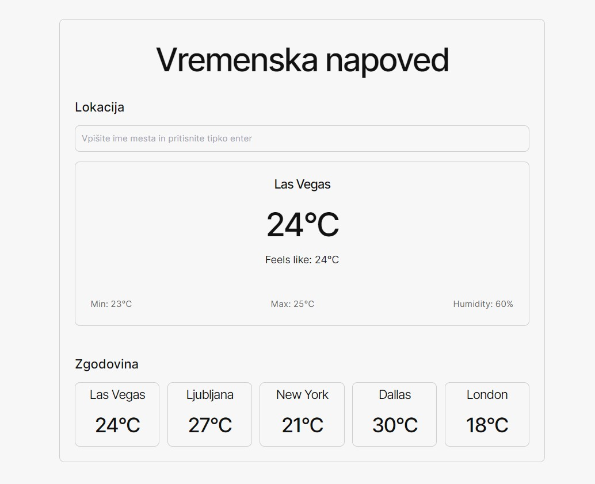

# WeatherApp - Real-time Weather Forecast



WeatherApp is a simple and user-friendly web application built with React and Vite that allows users to input a city name and receive real-time weather information. With a sleek and intuitive interface, users can quickly access current weather conditions for their desired location.

## Features

- **Real-time Weather:** Get up-to-date weather information for any city around the world.
- **Search by City:** Input the name of the city you want to know the weather for.
- **Temperature, Conditions, and More:** View temperature, humidity, and other relevant data.

## Technologies Used

- **React:** The frontend is built using React to create an interactive user interface.
- **Vite:** Vite is used as the build tool to optimize and bundle the app.
- **OpenWeatherMap API:** The OpenWeatherMap API is utilized to fetch real-time weather data.
- **Tailwind:** Custom CSS styles ensure an attractive and user-friendly design.

## Getting Started

Follow these instructions to get the WeatherApp up and running on your local machine.

1. **Clone the Repository:**

   ```bash
   git clone https://github.com/yourusername/weather-app.git

   ```

2. **Navigate to the Project Directory:**

   ```bash
   cd weather-app

   ```

3. **Install dependencies**

   ```bash
   npm install

   ```

4. **Set up API Key:**
   Get your API key by signing up at OpenWeatherMap.
   Create a .env file in the project root.
   Add your API key to the .env file:

   ```bash
   VITE_OPENWEATHERMAP_API_KEY=your_api_key_here

   ```

5. **Start the Development Server:**

   ```bash
   npm run dev

   ```

6. **Access the App:**
   Open your web browser and navigate to http://localhost:3000.

## Usage

Enter the name of the city you want to know the weather for in the input field.
Press the "Search" button or hit the "Enter" key.
The app will display the current weather conditions for the specified city.
